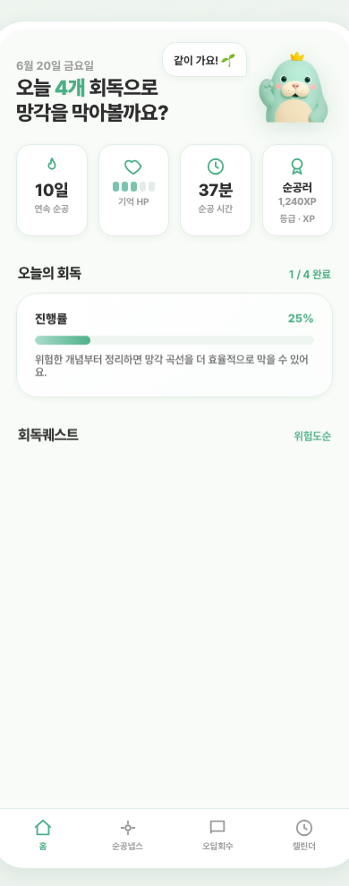
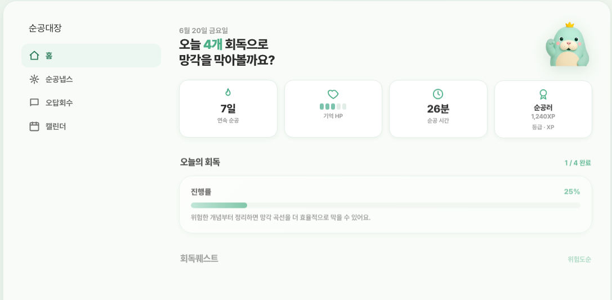

# 순공대장 (Soongong)

> **콴다는 학생의 막힘을 풀고, 순공대장은 학생의 까먹음을 푼다.**
> 문제를 풀어주는 AI가 아니라, **다시 풀게 만드는 AI** — 한국 수능에서 시작하는 학습 리텐션 엔진.

<sub>한국 수능생 · 인강 중심 독학재수생 · 오답관리가 약한 학생 대상 B2C 구독 SaaS.
1인 창업자가 **둥지(Soongong Nest) 에이전트 조직**(도메인 리드 6 + Orchestration/Tech Lead 통제 구조)을 운용해 8주 안에 동작시키는 AI-native 제품.</sub>

---

## 한 줄 비전

학생이 인강을 보고 끝내지 않도록, AI가 문제사진·오답·인강기록·캡처·메모를 매일 **회독퀘스트**로 바꿔주는 학습 리텐션 엔진.

> 핵심 메시지 — **"까먹기 전에 다시 풀자"**

---

## 화면 미리보기

| 모바일 앱 | 웹 |
|---|---|
|  |  |

현행 디자인 기준(SSoT):
- **`/styleguide`** — 통합 라이브 가이드 (소스 [`apps/web/src/views/styleguide`](apps/web/src/views/styleguide)). 접근법: [`docs/ops/styleguide-review-access.md`](docs/ops/styleguide-review-access.md)
- **디자인 시스템 잠금** [`docs/design-system/2026-06-09-design-system-lock.md`](docs/design-system/2026-06-09-design-system-lock.md) (v2.1, v2 Teal/Mint 팔레트)
- **최신 프로토타입** [`docs/prototypes/SOO-128/index.html`](docs/prototypes/SOO-128/index.html) (메인·회독·오답·순공냅스 통합)

---

## 핵심 차별점

1. **Source-to-Quest Engine** — 문제사진/인강기록/캡처를 단순 저장하는 것이 아니라 과목·단원·유형·오답원인·난이도·복습시점으로 구조화. 원본 최소 저장, 파생 학습 객체만 장기 누적.
2. **오답회수 모드** — 틀린 순간 해설만 보여주고 끝내지 않고, 가까운 변형 문제(V0-V5)로 단계적 회수. "이해한 것 같은 상태"가 아니라 **다시 맞히는 상태**까지 끌고 감.
3. **개인화 회독 스케줄** — 학생별 망각위험(시간경과 / 정답률 / 풀이시간 / 힌트사용 / 자신감) 기반으로 1/3/7/14일 자동 조정. 망각방어전 + 순공리그로 매일 복귀 유도.

학술 근거: 에빙하우스 망각곡선 (Murre & Dros 2015) · 분산학습 (Cepeda 2006) · 인출 연습 (Karpicke & Roediger *Science* 2008) · 섞어풀기 (Rohrer 2014).

---

## AI Agent 운용 — 둥지 (Soongong Nest)

1인 창업자가 에이전트를 "많이" 쓰는 게 아니라 **통제 구조로** 운용한다.

| 구성 | 역할 |
|---|---|
| **Orchestration Lead** | Mike의 단일 접점. 멀티도메인 작업을 분해·배분, 비가역/모트/비용 결정만 Mike에게 상신 |
| **Tech Lead** | acting CTO. 모든 머지 전 기술 리뷰 필수 게이트 |
| **도메인 리드 6** | AI 파이프라인 · 회독/망각 엔진 · 게임화 · UI/디자인 · 플랫폼/인프라 · 유형 리서치 |
| **Product Agents (16)** | 제품 내부에서 학생에게 작동하는 학습 분석 엔진 (백서 16 / MVP 1차 9) |

핵심 운용 원칙:
- **MOAT 영역(온톨로지 구조 · 베이지안 prior · retention 지표)은 에이전트 실행 0회** — 창업자가 직접 설계하는 비위임 레이어. 이것이 AI 래퍼와의 구조적 차이.
- 머지 플로우: 도메인 리드 빌드(`agent/<role>/<id>` 브랜치) → 코드래빗 승인 + (코드 PR은) Tech Lead 아키텍처 리뷰 + 필수 체크 green → **자동 머지(무중단, 2026-06-20 Mike 결정)**. PR-only · force/admin 머지·실패 체크 우회 금지(차터 룰7)
- 유형 리서치 에이전트는 제안만 출력, 온톨로지 자율 변경 금지

상세: [`2026-06-08-multica-squad-structure.md`](docs/agent-strategy/2026-06-08-multica-squad-structure.md)

---

## 기술 스택

| 계층 | 도구 |
|---|---|
| Frontend | Next.js 15 (App Router) + TypeScript 5 + Tailwind v4 + shadcn/ui + FSD 2.1 |
| Backend | Supabase (Postgres + RLS + Storage + Edge Functions + pgvector + Cron) |
| AI | Anthropic Claude API (Haiku 4.5 + Sonnet 4.6 + Mathpix OCR 옵션) + Vercel AI SDK |
| Pad solving | tldraw (웹 MVP) / Konva 폴백 |
| Hosting | Vercel |
| Storage 정책 | 원본 7-30일 자동 삭제, 파생 학습 객체만 장기 누적 |

---

## 빠른 시작

> 환경 트랙 결정사항(`docs/setup/2026-05-14-environment-decisions.md`)을 먼저 끝낸 후 진행.

```bash
# 1. clone
git clone git@github.com:mugungwhwa/soongong.git
cd soongong

# 2. 환경 변수 (.env.local 채우기)
cp docs/setup/.env.local.example apps/web/.env.local
# Supabase URL/keys + ANTHROPIC_API_KEY 입력

# 3. 의존성 + 마이그레이션
cd apps/web && pnpm install
pnpm dlx supabase db push

# 4. dev
pnpm dev
```

---

## 문서 구조

```
soongong/
├── README.md                                    ← 지금 이 파일
├── CLAUDE.md                                    ← Claude Code 자동 로드 SSoT
├── docs/
│   ├── RESUME.md                                ← 세션 재개 첫 진입점
│   ├── superpowers/plans/                       ← 마스터 플랜 + P1-P8 sub-plan 9종
│   ├── setup/                                   ← 환경 결정 + .env 템플릿
│   ├── prototypes/                              ← 화면 프로토타입 (SOO-96/97/103/108/128)
│   ├── design-system/                           ← 디자인 시스템 잠금 v2.1 + 인터랙션 스펙
│   ├── visual-assets/                           ← Midjourney + Canva 가이드
│   ├── agent-strategy/                          ← Agent 듀얼 트랙 매트릭스
│   └── sparkclaw/decks/                         ← 사업소개서 PDF (Deck A·B) + HTML 소스
├── apps/web/                                    ← Next.js 15 + FSD 2.1
│   └── public/brand/                            ← 로고 4종 · 마스코트 · 브랜드 자산
├── supabase/                                    ← migrations + Edge Functions
├── eval/                                        ← P2/P3 정확도 게이트 harness
├── 00_프로젝트_사업_전략/                         ← 사업/시장/SparkClaw 사업소개서
├── 01_제품_UX_게임화/                            ← UI 설계 v2.4 + 오답회수 + 게임성
├── 02_AI_Agent_학습엔진/                         ← 16-Agent 백서
├── 03_데이터_RAG_보안_법무/                       ← Raw/Derived 분리 정책
└── 04_개발_스택_구현/                            ← Next.js/Supabase/패드 캔버스
```

---

## 개발 진척

| Phase | 출력물 | 상태 |
|---|---|---|
| P1 Foundation | Next.js 15 + Supabase 인증 + 디자인 토큰 | ✅ main |
| P2 Source Intake | 문제사진 업로드 + Compliance Gate | ✅ main |
| P3 AI Pipeline | OCR + 학습 객체 라우팅 (E2E 검증 SOO-119) | ✅ main |
| P4 Scheduling | 1/3/7/14일 cron + 망각위험 함수 | ✅ main |
| P5 Home/Quest UI | 홈 위젯 + 퀘스트 카드 + 순공냅스 | ✅ main |
| P6 Play+Recovery | 회독 플레이 3단계 + 오답회수 + 풀이 캔버스 | ✅ main |
| P7 Game System | XP / 스트릭 / 기억HP / 뱃지 / 등급 | ✅ main |
| P8 Admin | 검수 UI + audit_logs + 오류 신고 | ✅ main |

현재 단계: P1~P8 전부 main 통합 완료. [Multica](https://multica.ai) 에이전트 조직으로 이슈 단위(SOO-XX) 개선 중.
각 phase 코드 수준 sub-plan: [`docs/superpowers/plans/`](docs/superpowers/plans/) (~6,500줄).

---

## 마스코트

**순공이 — 듀공(dugong), 확정.**
온화하고 끈질긴 평생 학습 동반자. 듀오링고의 부엉이(권위/위협)와 대비되는 브랜드 축.
Mike가 Midjourney + Canva로 직접 제작 (외주 없음).

작업 가이드: [`docs/visual-assets/2026-05-14-soongong-asset-inventory.md`](docs/visual-assets/2026-05-14-soongong-asset-inventory.md)

---

## 비즈니스 모델

| Plan | 가격 | 기능 |
|---|---|---|
| Free | 무료 | 문제사진 제한 / 오늘의 회독 일부 / 스트릭 |
| Super | 월 9,900원 | 무제한 회독 / 오답던전 / 망각방어전 |
| Max | 월 19,900원 | AI 유사문항 / 고급 리포트 / 4점보스 / 학부모 공유 |
| B2B/B2B2C | 별도 견적 | 독학재수학원·관리형 스터디센터 대시보드 |

**시장**: 사교육비 27.5조 / 고등학생 7.8조 / 2026학년도 수능 응시자 55.4만명.

자세히: [`00_프로젝트_사업_전략/SparkClaw_사업소개서.md`](00_프로젝트_사업_전략/SparkClaw_사업소개서.md)

---

## 보안 / 법무

- **Raw / Derived 분리** — 원본 문제사진·인강 캡처는 7-30일 자동 삭제, 파생 학습 객체만 장기 저장
- **Compliance Gate** — 업로드마다 저작권/PII 자동 분류
- **Supabase RLS** — 학생 본인 데이터만 접근, 모든 admin 액션 audit_logs 자동 기록
- **AI 분석 결과 고지** + 오류 신고 버튼
- **만 14세 미만** 보호자 동의 게이트 (개인정보보호법 준수)

자세히: [`03_데이터_RAG_보안_법무/유저_데이터_관리_보안.md`](03_데이터_RAG_보안_법무/유저_데이터_관리_보안.md)

---

## SparkClaw

SparkClaw 1인 창업 트랙 사업소개서 — v2 Teal/Mint 디자인 시스템 기반, HTML→PDF 빌드 완료.

| 산출물 | 파일 | 구성 |
|---|---|---|
| **사업소개서 (Deck A)** | [`docs/sparkclaw/decks/순공대장_사업소개서.pdf`](docs/sparkclaw/decks/순공대장_사업소개서.pdf) | 19슬라이드. 정체성→문제→솔루션→시장(망각곡선·듀오링고·TAM·경쟁맵)→BM→팀→비전 |
| **에이전트 개발형태 (Deck B)** | [`docs/sparkclaw/decks/순공대장_에이전트_개발형태.pdf`](docs/sparkclaw/decks/순공대장_에이전트_개발형태.pdf) | 9슬라이드. "순공을 어떻게 만드는가" |

소스 HTML: [`docs/sparkclaw/decks/`](docs/sparkclaw/decks/). 재렌더·시장 수치 출처: [`docs/sparkclaw/decks/README.md`](docs/sparkclaw/decks/README.md)

---

## 연락

- GitHub: [`mugungwhwa/soongong`](https://github.com/mugungwhwa/soongong)
- 작성자: Mike (`mikeikhoonkim1208@gmail.com`)

---

## License

미정 (MVP 1차 검증 단계). 출시 단계에서 결정.
